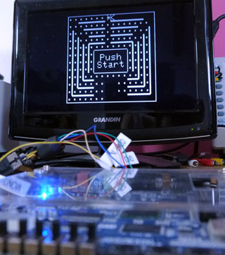

# DottoriLog
Sega's Dottori-Kun in Verilog

Based on information from Chris Covell: http://www.chrismcovell.com/dottorikun.html

Meant to run on an Altera/Terasic DE1 FPGA devboard.
Only 2 common Altera "megafunctions" are used for RAM and ROM (check out that .hex file).

Making it work on other devices shouldn't be too hard and is all up to you :)

2017 Furrtek - Released in the Public domain.
